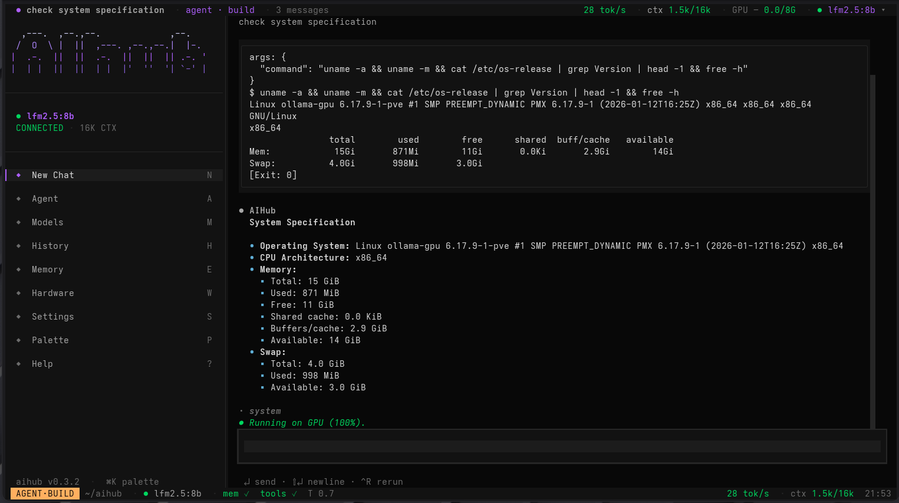

<div align="center">

# AIHub 🤖

**A chat-first terminal UI for your local AI models.**

AIHub is a full-screen [Textual](https://textual.textualize.io/) TUI for running, managing, and chatting with AI models — **local models through Ollama _and_ cloud API models** (Anthropic, OpenAI, Google) from the same interface. It pairs a fast keyboard-driven chat with hardware-aware model selection, persistent memory, a tool-calling agent mode, and live GPU/throughput readouts — all in the terminal.

[](https://www.python.org/)
[](LICENSE)



</div>

## Features

### Chat-First TUI
Running `aihub` opens the full-screen terminal interface:
- **Keyboard-driven** — single-key navigation from the sidebar: `N` New Chat, `A` Agent, `M` Models, `H` History, `E` Memory, `W` Hardware, `S` Settings, `P` Palette, `?` Help.
- **Live status bars** — top header and vim-style footer show the active model, connection state (green `CONNECTED` / red `OFFLINE`), **context fill** (`ctx 1.5k/16k`), **tokens/sec** (colour-coded: green = fast/GPU, red = slow/CPU), and **GPU/CPU usage**.
- **Streaming chat** — token-by-token replies, with `↵` send · `⇧↵` newline · `^R` rerun.
- **Command palette** — `⌘K` / `P` to jump to any action.

### Agent Mode
A tool-calling agent (`A`) with **plan** and **build** sub-modes that can run terminal commands, read/write/edit files, search files, and search the web to complete multi-step tasks:
- **VRAM-aware context** — agent sessions auto-pick the largest context that fits your GPU (capped at the model max), so they stay on the GPU instead of spilling to CPU.
- **Placement check** — after the first response, AIHub reports whether the model loaded on **GPU**, **partial GPU**, or **CPU** (via Ollama's `/api/ps`).
- Tool calls and their output are shown inline in the chat log.

### Hardware Scanner
Automatically detects your system hardware and recommends models that fit:
- **GPU Detection**: NVIDIA (nvidia-smi, GPUtil), AMD (rocm-smi, lspci), Intel, Windows (WMI)
- **CPU Info**: Model, physical/logical cores, clock speed
- **RAM & Disk**: Total, available, usage percentage
- **VRAM-based filtering**: Models ranked by best-fit for your hardware
- **Inference speed estimator**: Heuristic tokens/sec based on detected VRAM

### Model Browser & Registry
- **104 models** in built-in registry (chat, code, reasoning models)
- **Live Ollama integration**: Shows locally installed models
- **Hardware-aware sorting**: Installed models first, then sorted by VRAM fit
- **Capability badges**: Tool Calling, Code, Reasoning, Multilingual, etc.
- **Category filters**: Small / Medium / Large / XLarge

### Cloud API Models
Beyond local Ollama models, AIHub chats with **cloud API models** through the same
interface — local and cloud models sit side by side in the model picker:
- **Anthropic** — Claude Opus 4.8, Sonnet 4.6, Haiku 4.5
- **OpenAI** — GPT-4o, GPT-4o mini, GPT-4 Turbo, o1-mini
- **Google** — Gemini 2.0 Flash, Gemini 1.5 Pro / Flash

Responses stream just like local models, and memory, history, and agent mode all
work with API models too. Add your keys in **Settings** (`S`) → *API keys*, or set
`openai_api_key` / `anthropic_api_key` / `google_api_key` in the config file. No key
is needed for local Ollama models.

### Interactive Chat
- **CLI chat**: Quick chat sessions from command line
- **Streaming responses**: Real-time token-by-token output
- **Configurable context**: Adjustable context window (num_ctx)
- **Temperature control**: Adjust model creativity

### Memory System
AIHub provides a powerful memory system that allows models to "remember" information across sessions.

#### Per-Model Memory
Each model has its own memory file stored at:
```
~/.aihub/memory/<model_name>.md
```
Memory is stored as human-readable Markdown, making it easy to view and edit directly.

#### Global Memory
A shared memory that applies to all models:
```
~/.aihub/memory/global.md
```
Enable in config: `global_memory_enabled: true`

#### How Memory Works
1. **System Prompt Injection**: Memory content is automatically injected as a system prompt at the start of each chat session
2. **Auto-Extraction**: AIHub can automatically summarize and save important information from your current chat session to memory

#### Memory Slash-Commands
During chat, use these commands to manage memory:

| Command | Description |
|---------|-------------|
| `/memory` | View current memory for this model |
| `/memory save <key> <value>` | Save a specific fact manually |
| `/memory clear` | Clear all memory for current model |
| `/memoryadd global` | Auto-extract key facts from chat to **global memory** |
| `/memoryadd chat` | Auto-extract key facts from chat to **model memory** |
| `/history` | Browse and resume past sessions |
| `/tools` | List available agentic tools |
| `/clear` | Clear the current chat context (start fresh) |
| `exit` / `quit` / `q` | End the chat session |

#### How Auto-Extraction Works (`/memoryadd`)
When you use `/memoryadd chat` or `/memoryadd global`:

1. **Collection**: AIHub collects the last 30 messages from your current chat session
2. **Analysis**: It sends these messages to your currently active local Ollama model with a special prompt asking it to extract key facts, user preferences, and important information
3. **Summarization**: The model analyzes the conversation and creates a clean Markdown list of the most important points
4. **Saving**: The extracted facts are saved to either:
   - **Model memory**: `~/.aihub/memory/<model_name>.md` (using `/memoryadd chat`)
   - **Global memory**: `~/.aihub/memory/global.md` (using `/memoryadd global`)
5. **Timestamp**: Each extraction is tagged with a timestamp, so previous memories are preserved

This allows the model to "remember" your preferences, project context, and other important details across future sessions.

#### Manual Memory Management
You can also manually edit memory files directly:
```
~/.aihub/memory/llama3.2:3b.md    # Model-specific memory
~/.aihub/memory/global.md         # Shared global memory
```

#### Memory File Format
```markdown
<!-- AIHub Memory File — model: llama3.2:3b | created: 2026-04-12 -->

## User Preferences
- Prefers concise answers
- Likes code examples

## Project Context
- Working on Python CLI tool
- Using FastAPI framework
```

### Tool-Calling Agentic System
AIHub provides 7 built-in tools for agentic workflows:
- **`run_terminal`**: Execute shell commands (with safety warnings)
- **`read_file` / `write_file` / `edit_file`**: Read, create, and edit files
- **`list_files`**: List directory contents
- **`search_web`**: Search the web via DuckDuckGo (no API key needed)
- **`search_files`**: Glob and grep search across directories

Tools work with Ollama models that support function calling (e.g., llama3.2:3b, qwen2.5:14b).

### History Management
- **Persistent sessions**: Save and resume chat sessions
- **Per-model history**: Organized by model name
- **Configurable limits**: Max saved sessions per model
- **Session browser**: Browse and load past conversations

### Multi-Platform Support
- **Linux**: Full support with all GPU detection methods
- **Windows**: WMI-based GPU detection
- **Cross-platform**: Portable config at `~/.aihub/config.yaml`

---

## The Interface


The screenshot above shows agent mode (`AGENT·BUILD`) running a system-spec check: the
sidebar with single-key navigation, the model pill (`● lfm2.5:8b · CONNECTED · 16K CTX`),
the live header (`28 tok/s · ctx 1.5k/16k · GPU`), inline tool output, the green
`● Running on GPU (100%)` placement line, and the vim-style footer.

### Keyboard Shortcuts

| Key | Action | Key | Action |
|-----|--------|-----|--------|
| `N` | New Chat | `W` | Hardware scan |
| `A` | Agent mode | `S` | Settings |
| `M` | Models browser | `P` / `⌘K` | Command palette |
| `H` | History | `?` | Help |
| `E` | Memory | `↵` / `⇧↵` | Send / newline |
| | | `^R` | Rerun last message |

---

## Installation

### One-liner (Linux / macOS)

```bash
git clone https://github.com/marceljurgiel/AIhub-TUI.git && cd AIhub-TUI && ./install.sh
```

`install.sh` installs any missing system packages (git, python3, venv, pip — via
apt/dnf/pacman/zypper, using `sudo` when not root), creates a local virtualenv
(`.venv`), and installs the app plus the `aihub` command. Then run:

```bash
source .venv/bin/activate && aihub
```

Options: `INSTALL_OLLAMA=1 ./install.sh` also installs the Ollama runtime;
`PYTHON=python3.12 ./install.sh` picks a specific interpreter. Cloud API models
(OpenAI / Anthropic / Google) work without Ollama; local models require it.

### GPU not being used (CPU instead)?

The GPU-vs-CPU decision is made by the **Ollama server**, not aihub. aihub helps
in three ways:

- **Auto-fit context** — the per-chat context length defaults to the largest that
  fits your detected GPU VRAM, and warns (red) if a value you pick will spill the
  KV cache to CPU.
- **Force GPU** — Settings → *Ollama GPU layers (num_gpu)*: `0` = auto,
  `999` = force all layers onto the GPU.
- **Placement check** — after your first message, aihub reports `Running on GPU`,
  `Partial GPU`, or `Running on CPU` (via Ollama's `/api/ps`).

If it still runs on CPU: confirm the **server** can use the GPU (`ollama run <model>`
should use it) and that there's enough free VRAM for the model + context. On AMD
this needs a working ROCm setup on the server (e.g. `HSA_OVERRIDE_GFX_VERSION` for
some cards) — configured where Ollama runs, not in aihub.

### Updating

To pull the latest version any time (force-syncs to the pushed version, even if
`git pull` gets blocked by local edits):

```bash
cd AIhub-TUI && ./update.sh && source .venv/bin/activate && aihub
```

Tip — add a shortcut: `echo "alias aihub-update='cd ~/AIhub-TUI && ./update.sh'" >> ~/.bashrc`,
then just run `aihub-update`. (`update.sh` hard-resets to `origin/main`, so it
discards local edits — intended for a deploy/test box. Requires git auth set up
once via `gh auth login` or a stored token for the private repo.)

### Linux Manual Install

```bash
# Clone the repository
git clone https://github.com/marceljurgiel/AIhub-TUI.git
cd AIhub-TUI

# Create virtual environment (optional but recommended)
python -m venv venv
source venv/bin/activate

# Install dependencies
pip install -r requirements.txt

# Install AIHub
pip install -e .
```

### Windows Installation

#### Prerequisites
1. **Python 3.9+** - Download from https://www.python.org/downloads/
2. **Ollama for Windows** - Download from https://ollama.com/download/windows

#### Steps

```powershell
# Clone the repository
git clone https://github.com/marceljurgiel/AIhub-TUI.git
cd AIhub-TUI

# Create virtual environment
python -m venv venv
venv\Scripts\Activate

# Install dependencies
pip install -r requirements.txt

# Install AIHub
pip install -e .
```

#### Running on Windows

```powershell
# Activate virtual environment
venv\Scripts\Activate

# Run AIHub
aihub
```

Or install globally:

```powershell
# Install globally
pip install -r requirements.txt
pip install -e .

# Run from anywhere
aihub
```

---

## Running AIHub

After installation, simply run:

```bash
aihub
```

With no arguments this launches the **full-screen TUI**. The subcommands below stay
available for quick scripted/CLI use.

### Available Commands

| Command | Description |
|---------|-------------|
| `aihub` | Launch the full-screen TUI |
| `aihub chat` | Start interactive chat session (shows model selector) |
| `aihub chat <model>` | Start chat with specific model |
| `aihub models-list` | List all available models with hardware compatibility |
| `aihub models-download <name>` | Download a model via Ollama |
| `aihub hardware-scan` | Run hardware diagnostics and see recommended models |
| `aihub history <model>` | Browse chat history for a specific model (required) |
| `aihub config` | Show configuration file path and current settings |

### Inside the TUI
Running `aihub` opens the chat screen. From there, use the single-key sidebar
shortcuts (see [Keyboard Shortcuts](#keyboard-shortcuts)) to browse models (`M`),
enter agent mode (`A`), open history (`H`), manage memory (`E`), run a hardware
scan (`W`), or edit settings (`S`). Press `?` for in-app help.

---

## Configuration

AIHub stores config at `~/.aihub/config.yaml`:

```yaml
# Model Settings
ollama_api_url: http://localhost:11434
default_chat_model: qwen:0.5b
default_context_length: 2048      # default num_ctx; chat auto-fits to VRAM
ollama_num_gpu: 0                 # 0 = auto · 999 = force all layers on GPU
models_registry_path: /path/to/models_registry.json

# Cloud API keys (optional — only needed for API models)
openai_api_key: ""
anthropic_api_key: ""
google_api_key: ""

# Agent Mode
agent_min_context: 16384          # min model context to allow agent mode
agent_default_context: 32768      # context agent sessions request (capped to model max)

# Tool Settings
tools_enabled: true
tool_timeout_seconds: 60

# Memory Settings
memory_enabled: true              # inject memory into chat sessions

# History
max_history_sessions: 50
```

> Most settings are editable in-app via **Settings** (`S`) — including the
> *Ollama GPU layers (num_gpu)* lever for forcing GPU usage.

### Data Directories

| Directory | Path |
|-----------|------|
| Config | `~/.aihub/config.yaml` |
| Memory | `~/.aihub/memory/` |
| History | `~/.aihub/history/` |

---

## Tool Calling Usage

To use tools (web search, terminal, file ops), select a model with tool calling capability:

1. Start a chat session with a model that has tool calling capability
2. Ask questions requiring external data

Example:
```
You: What's the latest Python version?
[Model detects need for web search, calls search_web tool]
[Results fed back to model]
Model: The latest Python version is 3.13.0 (released October 2024)
```

---

## Feature Plans: Prebuilt Agents & Skills

*These features are planned for future versions.*

### Prebuilt Agents

#### Plan Agent
An intelligent agent that analyzes complex tasks and creates detailed execution plans. Breaks down goals into manageable steps with clear dependencies.

#### Executor Agent
Takes a pre-made plan and executes it step-by-step. Can call tools, run terminal commands, and interact with files to complete the task.

#### Auto Mode
The most autonomous option - the model:
1. **Plans**: Analyzes the task and creates a plan
2. **Confirms**: Shows you the plan and asks for confirmation
3. **Executes**: Once confirmed, carries out the plan automatically

### Skills System
Reusable prompt templates for common tasks:
- **Code Review**: Analyze code for bugs and improvements
- **Documentation**: Generate documentation from code
- **Refactoring**: Suggest and apply code improvements
- **Testing**: Create test cases for functions
- **Debugging**: Help identify and fix bugs

Skills can be invoked with commands like `/skill review` or `/skill test`.

---

## Future Features

### llama.cpp Backend
Optional `llama-server` (OpenAI-compatible) backend alongside Ollama — already
scaffolded behind `llamacpp_enabled` in config.

---

## Change Log

The **0.2.x–0.3.x** line is the chat-first Textual TUI rebuild. Full history,
including the earlier menu-based CLI era, is in [CHANGELOG.md](CHANGELOG.md).

### 0.3.13 — 2026-07-14
- **Fixed tool calling for imported GGUFs** — imported models (e.g. gemma 4)
  were reported as "does not support tool calling". Cause: Ollama derives tool
  support from the chat template, and imported templates had no tool sections.
  The injected ChatML / Llama 3 / Gemma templates now include proper
  `.Tools`/`.ToolCalls` handling (imports report the `tools` capability and
  pass the agent gate), existing imports self-heal on next pick, and the chat
  engine gains a **fallback tool-call parser** that recovers calls models emit
  as plain/fenced/tagged JSON that Ollama's parser misses.

### 0.3.12 — 2026-07-14
- **Fixed HuggingFace downloads failing (403)** — HF's plain-HTTP CDN bridge
  currently rejects large-file downloads (known infra issue). Downloads now go
  through the official Xet-aware `huggingface_hub` client (with in-app
  progress), which works — anonymously too. Raw HTTP stays as fallback, with a
  clearer error message.

### 0.3.11 — 2026-07-13
- **Fixed gibberish replies from imported GGUFs** — imports got Ollama's raw
  `{{ .Prompt }}` template (no chat wrapping, no stop tokens), so models
  answered "hi" with random numbers/code. AIHub now reads the chat template
  embedded in the GGUF file itself and installs the matching Ollama template
  (ChatML, Llama 3, Gemma, Mistral, Phi) + stop tokens at import. Models
  imported by older versions are **healed automatically** the next time you
  pick them.

### 0.3.10 — 2026-07-13
- **Touchless GGUF running** — pick a downloaded GGUF in Installed and it just
  runs: first pick auto-imports it into Ollama (one-time, ~10–60 s, progress
  shown), then opens straight into a chat; every later pick shows
  `✓ imported · Enter to run` and starts instantly. Incomplete downloads are
  blocked with a clear warning. No confirmation dialogs, no manual
  llama-server.

### 0.3.9 — 2026-07-13
- **Fixed missing sizes in the HuggingFace tab** — HF's search API stopped
  returning file information, so every model and quant showed `?GB`. Model
  details (with sizes) are now fetched concurrently for all results (~1 s),
  and the quant picker re-fetches sizes when needed — real GB everywhere.

### 0.3.8 — 2026-07-13
- **Fixed: New Chat kept old history** — sidebar clicks were never wired up, so
  clicking *New Chat* (or any sidebar entry) silently did nothing and the old
  conversation kept feeding the model — small models then "talked nonsense" to a
  simple *hi*. All sidebar entries and the model pill now dispatch properly, and
  New Chat also resets token counters and agent mode.

### 0.3.7 — 2026-07-13
- **Downloaded GGUFs are now visible and usable** — models downloaded via the
  Recommended or HuggingFace tabs used to vanish (saved to `~/.aihub/models/`
  but never listed). The Installed tab now shows every downloaded `.gguf`
  (partial downloads flagged), and selecting one offers a one-click **import
  into Ollama** so it becomes a regular installed model — no llama-server
  needed. `X` deletes a downloaded file. After any GGUF download you're
  offered the import immediately.

### 0.3.6 — 2026-07-09
- **Device counter follows the model** — when the loaded model actually runs on CPU
  (per Ollama's `/api/ps`), the header switches its GPU readout to a CPU counter;
  it returns to GPU stats once the model is GPU-resident again.
- **Settings redesigned** — one long scroll replaced by four tabs (General ·
  Performance · Connections · API Keys), with a detected-GPU line and a CPU-spill
  tip on the Performance tab. All settings and shortcuts unchanged.

### 0.3.5 — 2026-07-09
- **Removed duplicate context counter** from the bottom footer — the top header
  already shows it. The footer's right side now reads just `tok/s · clock`.

### 0.3.4 — 2026-06-12
- **Fixed AMD GPU detection** — `rocm-smi` was called with `--showvram`, which newer
  ROCm versions don't support; its error/usage spew leaked onto the terminal and
  corrupted the TUI. Now uses `--showmeminfo vram --json` (portable), parses **real**
  VRAM size, model name, and live GPU use % (previously hardcoded 8 GB / unknown),
  and all hardware subprocess calls silence stderr so tool output can never break
  the screen again.

### 0.3.3 — 2026-06-12
- **Fixed Web Search** — the public `duckduckgo.com/html/` endpoint started serving an
  empty stub page, so search silently returned no results. Switched to the working
  scrape host with a lite-host fallback, handled the new direct-href format, and
  filtered sponsored/ad results.

### 0.3.2 — 2026-06-11
- **Tokens/sec counter** in the header and footer, colour-coded (green = fast/GPU,
  red = slow/CPU), using Ollama's precise `eval_duration` when available.
- **Agent mode stays on GPU** — agent sessions auto-fit their context to free VRAM
  instead of forcing a large window that spills to CPU.

### 0.3.1 — 2026-06-11
- **Keep inference on the GPU** — chat context auto-fits to detected VRAM (with a red
  warning when a chosen value would spill to CPU).
- **`num_gpu` force lever** in Settings (`0` = auto, `999` = force all layers on GPU).
- **GPU placement check** — after the first response, AIHub reports GPU / partial / CPU
  via Ollama's `/api/ps`.

### 0.3.0 — 2026-06-11
- **Reference UI redesign** — top header bar, vim-style footer, sidebar with the model
  pill and single-key navigation, markdown rendering in the chat log.
- **Live status** — token counter, GPU/CPU usage, `CONNECTED`/`OFFLINE` indicator, and
  an llmfit-style hardware-fit table in the model picker.
- **App version in the sidebar**; `install.sh` installs a global `aihub` command and a
  self-healing `update.sh` for one-command updates.

### 0.2.0 — 2026-06-07
- **Chat-first TUI rebuild** on Textual — full-screen chat replaces the menu-based CLI.
- **Cloud API models** (Anthropic, OpenAI, Google) alongside local Ollama, plus an
  optional llama.cpp backend.
- **Agent mode** (plan/build) ported from OpenCode, with an llmfit-based hardware-fit
  engine and the 7-tool calling system.

---

## Development

### Project Structure

```
aihub/
├── aihub/
│   ├── cli.py          # Entrypoint — launches the TUI; CLI subcommands
│   ├── config.py       # Configuration loading
│   ├── hardware.py     # Hardware detection + VRAM-fit context
│   ├── fit.py          # llmfit-based hardware recommendations
│   ├── memory.py       # Memory system
│   ├── chat.py         # Chat turn engine (streaming events)
│   ├── agent.py        # Agent mode (plan/build) harness
│   ├── ollama_client.py
│   ├── llamacpp_client.py
│   ├── models.py       # Model registry utilities
│   ├── history.py      # Session management
│   ├── tui/            # Textual TUI
│   │   ├── app.py
│   │   ├── chat_screen.py
│   │   ├── widgets/    # sidebar, status_bar, chat_log, …
│   │   └── modals/     # settings, model_picker, hardware, …
│   └── tools/          # Tool-calling system
│       ├── terminal.py
│       ├── file_ops.py
│       ├── web_search.py
│       └── file_search.py
├── models_registry.json
├── requirements.txt
├── install.sh
└── pyproject.toml
```

### Running Tests

```bash
pytest tests/
```

---

## License

MIT License - See [LICENSE](LICENSE) for details.

---

## Acknowledgments

- [Ollama](https://ollama.com/) - Local AI runtime
- [Questionary](https://questionary.readthedocs.io/) - CLI prompts
- [Rich](https://rich.readthedocs.io/) - Terminal formatting
- [llmfit](https://github.com/AlexsJones/llmfit) (MIT) - the "Recommended" hardware-fit
  engine is a Python port of its approach; the model catalog in
  `aihub/data/llmfit_models.json` is derived from llmfit's database
  (see `aihub/data/LICENSE-llmfit`)
- [OpenCode](https://github.com/sst/opencode) (MIT) - Agent mode's plan/build harness,
  permission model, system prompts, and tool descriptions are ported/adapted from
  OpenCode (see `aihub/data/LICENSE-opencode`)
