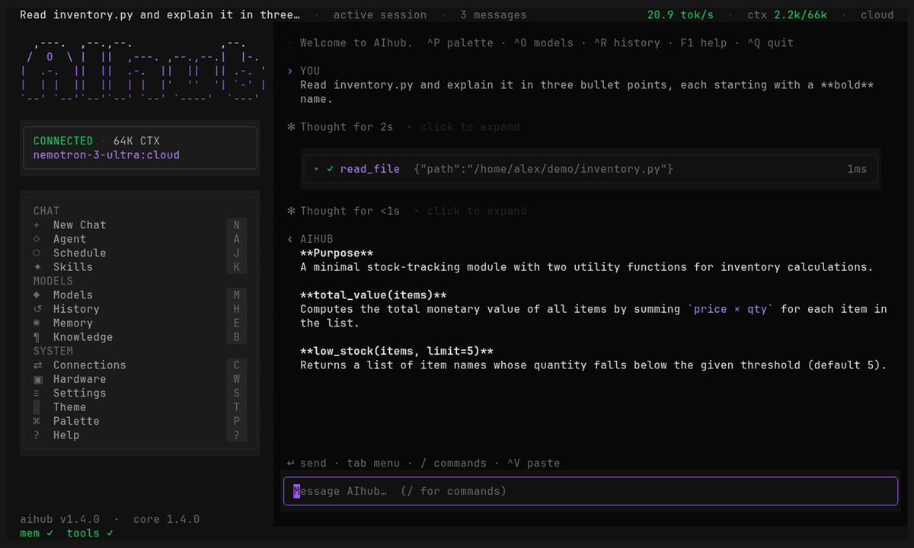
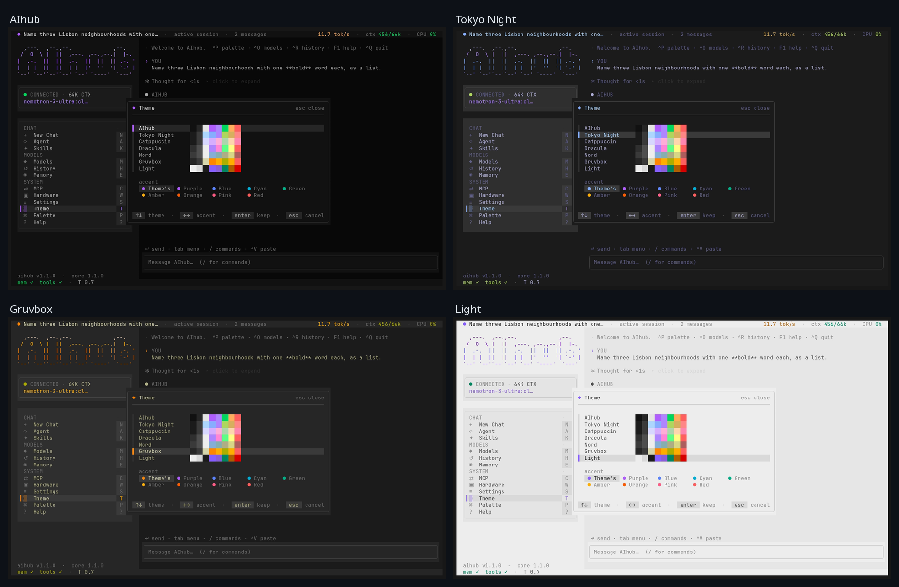

<div align="center">

# AIhub

**Local AI in your terminal: chat, agents, tools and MCP, on your own models.**

[](https://github.com/marceljurgiel/AIhub-TUI/actions/workflows/ci.yml)
[](LICENSE)


</div>

<p align="center"></p>

AIhub is a keyboard-driven terminal app for the models you run yourself with
[Ollama](https://ollama.com), on this computer or on a GPU box elsewhere on your
network. It also works with Ollama's free cloud models and with the Anthropic,
OpenAI and Google APIs.

## Install

**Linux / macOS**

```bash
curl -fsSL https://raw.githubusercontent.com/marceljurgiel/AIhub-TUI/main/install.sh | bash
```

**Windows 10 / 11** (PowerShell)

```powershell
irm https://raw.githubusercontent.com/marceljurgiel/AIhub-TUI/main/install.ps1 | iex
```

Then open a new terminal and run `aihub`.

<p align="center"></p>

The installer needs no administrator rights and no Python or Node already
installed. It sets up:

- **uv** with its own Python 3.12, which runs the AIhub engine;
- **Bun**, which runs the terminal app;
- the **`aihub`** command;
- **Ollama**, if you want it. The installer asks whether to:
  - install Ollama on this computer;
  - use an Ollama server on your network (enter its address, e.g. `192.0.2.10`);
  - skip it for now.

  It can then download a starter model sized for your RAM.

To update, run `aihub update` or run the installer again. Your chats and
settings in `~/.aihub` are kept.

<details>
<summary>Unattended install and options</summary>

```bash
# Linux / macOS
curl -fsSL https://raw.githubusercontent.com/marceljurgiel/AIhub-TUI/main/install.sh \
  | bash -s -- --yes --ollama http://192.0.2.10:11434 --model none
#   --ollama local | skip | <server url>     --model <name> | none     --dir <path>
#   --knowledge   also download the embedding model for knowledge bases
```

```powershell
# Windows
$env:AIHUB_YES = "1"; $env:AIHUB_OLLAMA = "local"; $env:AIHUB_MODEL = "llama3.2:3b"; $env:AIHUB_KNOWLEDGE = "1"
irm https://raw.githubusercontent.com/marceljurgiel/AIhub-TUI/main/install.ps1 | iex
```

| Where | Linux / macOS | Windows |
|---|---|---|
| App | `~/.local/share/aihub` | `%LOCALAPPDATA%\AIhub` |
| Command | `~/.local/bin/aihub` | `%LOCALAPPDATA%\AIhub\bin\aihub.cmd` |
| Settings, chats, memory | `~/.aihub` | `%USERPROFILE%\.aihub` |

To uninstall:

- **Linux / macOS:** run `aihub uninstall`.
- **Windows:** delete `%LOCALAPPDATA%\AIhub` and remove its `bin` folder from your PATH.

Uninstalling leaves `~/.aihub` in place.
</details>

## What it does

- **Chat** with streaming answers. It shows context fill and tokens/s, and
  whether the model runs on the GPU or the CPU. Answers render as Markdown.

<p align="center"></p>
- **Memory** (`E`). AIhub learns facts you mention while you chat and
  uses them in later chats. Every change shows up in the chat with an undo
  link, and you can read and edit the whole memory.

<p align="center"></p>
- **Knowledge** (`B`) is search over your own documents. Make a knowledge
  base from folders or files (notes, manuals, code, PDF, Word). AIhub finds
  the passages that match a question and the model answers from them,
  citing them as [1], [2]. Everything stays on your machine, with embeddings
  by [EmbeddingGemma](https://ollama.com/library/embeddinggemma) in your
  Ollama.
  - Give a base to an agent: Agents → `k`.
  - Use one in any chat: `/kb <name>`.
  - The embedding model (about 620 MB) downloads on first use, or right
    away with the installer's `--knowledge` option.
- **Tools that ask first.** The model can read and edit files, run terminal
  commands (PowerShell on Windows) and search the web. Anything that changes
  your system waits for your OK. **Agent mode** (`A`) plans and builds
  bigger tasks.

<p align="center"></p>

- **Schedule** (`J`, `F7`) runs an agent on a timetable: every 30 minutes,
  daily at 08:00, on weekdays, weekly, or once. Say "every morning, summarize
  my new email", and the answer is waiting in History (`Enter` in Schedule
  opens it).
  - **It runs only while AIhub is open.** If a time passed while AIhub was
    closed, AIhub asks whether to run the task when it starts.
  - A task runs with its agent's tools. Anything that agent would ask you
    about is refused, since nobody is there to answer.
  - Your own chat comes first: a task waits for an answer in progress, and
    one model request runs at a time.
  - `/schedule run <name>` runs a task now.

- **Models** (`Ctrl+O`):
  - Browse the Ollama library and Hugging Face GGUFs, ranked by how well they
    fit your hardware or your server's.
  - Download, delete and switch models.
  - Each model shows badges for what it can do: tools, vision, thinking and cloud.
- **Ollama Cloud.** Sign in with `ollama signin` to use the big open models
  (`…:cloud`) for free, within Ollama's limits.

<p align="center"></p>

- **Connections** (`C`) let AIhub use your services. Anything that sends,
  deletes or changes something asks you first.
  - **Google** — Gmail, Calendar and Drive in one go: press Connect and
    sign in with Google in your browser. Google may say the app isn't
    verified yet: *Advanced → Go to AIhub*.
  - **More:** GitHub, Notion, Obsidian, web pages (Fetch), Git, a real
    browser (Playwright), library docs (Context7) and Home Assistant, each
    with the one or two things it needs.
  - **For developers:** connections are
    [MCP](https://modelcontextprotocol.io) servers. You can add any MCP
    server or import the ones you set up for Claude.

<p align="center"></p>

- **Images.** With a vision model, paste a screenshot with `Ctrl+V`, or drag a
  file into the terminal.
- **Skills** (`K`) are reusable instructions the model picks up when a
  request matches. You can write one in a sentence and the model drafts it,
  find one online (skills.sh, SkillsMP), or link a GitHub folder. Use it with
  `/skill <name>`.

<p align="center"></p>
- **History** (`Ctrl+R`): pick up any earlier chat.
- **Hardware** (`W`) shows your GPU, VRAM and RAM. Context size is chosen
  automatically so the model stays in GPU memory, or set it by hand for a
  model in Settings → `c` (any size, e.g. `24k`; `a` goes back to automatic).
- **Themes** (`T`): seven colour themes (Tokyo Night, Catppuccin, Dracula,
  Nord, Gruvbox, Light…) and an accent colour of your choice, previewed live.

<p align="center"></p>

<p align="center"></p>

- **Temperature** (`Ctrl+T`), **Settings** (`S`), **Command palette**
  (`Ctrl+P`), **Help** (`F1`).

`Ctrl+Q` quits, and `Esc` stops an answer.

### On Windows

The same app in Windows Terminal, here with a small local model on the CPU:

<p align="center"></p>

## Using an Ollama server

To run the models on a stronger machine:

1. On that machine, make Ollama listen on the network by setting
   `OLLAMA_HOST=0.0.0.0`.
2. Point AIhub at it: choose **S** in the installer, or open
   **Settings → Ollama URL** in AIhub.

AIhub learns the server's speed and GPU memory from your chats, so its model
recommendations and context sizes match that machine, not the laptop you type on.

## Command line

```bash
aihub              # start the app
aihub update       # update
aihub version
aihub cli --help   # scriptable tools: models-list, models-download, hardware-scan, chat …
```

## How it is built

```
app/   terminal UI — TypeScript, React on OpenTUI, runs on Bun
aihub/ engine — Python: Ollama/API clients, agent + tools, memory, MCP, hardware
```

The app starts the engine (`python -m aihub.bridge`) and the two talk
newline-delimited JSON over stdio.

## Development

```bash
git clone https://github.com/marceljurgiel/AIhub-TUI && cd AIhub-TUI
uv venv --python 3.12 && uv pip install -e ".[dev]"
(cd app && bun install)

.venv/bin/python -m pytest          # engine tests
(cd app && bun test && bunx tsc --noEmit)
(cd app && bun run start)           # run from the checkout
```

See [CONTRIBUTING.md](CONTRIBUTING.md). AIhub is MIT-licensed.
